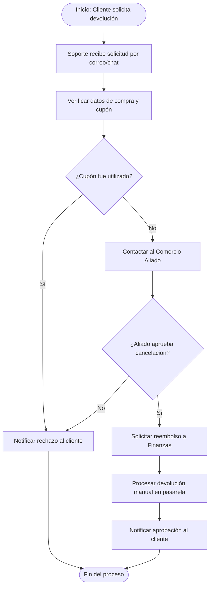

# INF320-Automatizacion-Procesos-Negocios-2026-2

---

## 4. Diagrama del Proceso AS-IS (Gestión de Devoluciones)

```mermaid
graph TD
    A([Inicio: Cliente solicita devolución]) --> B[Soporte recibe solicitud por correo/chat]
    B --> C[Verificar datos de compra y cupón]
    C --> D{¿Cupón fue utilizado?}
    
    D -- Sí --> E[Notificar rechazo al cliente]
    E --> F([Fin del proceso])
    
    D -- No --> G[Contactar al Comercio Aliado]
    G --> H{¿Aliado aprueba cancelación?}
    
    H -- No --> E
    H -- Sí --> I[Solicitar reembolso a Finanzas]
    I --> J[Procesar devolución manual en pasarela]
    J --> K[Notificar aprobación al cliente]
    K --> F
```
